# 8-bit color VGA display for STM32F411CEU6 (Black Pill) with USB-host for keyboard

A working example for 8-bit color VGA display and USB-HID host for WeAct Black Pill board using (mainly)HAL API.

### Key functions:
- An example to use DMA-to-Peripheral for STM32 to push output patterns (8 bits at once). Here, we send the output via DAC using resistors as R/G/B signals for VGA display.
- An example to generate H-sync and V-sync for VGA display at 640x480@57Hz
- USB-OTG as USB-Host for general USB keyboard. 
- A simple Tetris game to show an implementation of using GPIO input alongside the VGA display code.

[](https://www.youtube.com/watch?v=OERbGQO6_Fc)


## Video Mode and Timing
VGA 640x480 @60 Hz (pixel frequency: 25.175MHz)

**Running in a custom frequency for pixel frequency = 24MHz

### Horizontal timing:

Visible Area 640px. <br />
Front porch 16px. <br />
Sync pulse 96px. <br />
Back porch 48px. <br />
Whole Line 800px.

### Vertical timing:

Visible Area 480 lines. <br />
Front porch 10 line. <br />
Sync pulse 2 lines. <br />
Back porch 33 lines. <br />
Whole frame 525 lines.

## Important Note

- This example uses DMA memory-to-Peripheral with a very high speed. If you enable NVIC or using DMA for other parts within the code, you might find the screen to flicker or the video frame would move horizontally.
- If you only use polling for other I/Os or there is not much going on within the program, you could increase the resolution to 320x240. (see the end of this README) 
- Port PB0-PB7 are set as GPIO outputs for RGB signals. Keep in mind that we use DMA to write data directly to register address for PB port. So you might find a problem using PB8-PB15 as GPIO output, however, using them as GPIO input or other functions works fine.
- We send the output signal at 1/4th of VGA output (at 6 MHz instead of 24 MHz). Thus, the actual resolution is down to 160x480px. To keep the aspect ratio, I have to send each line 4 times, so the resolution is actually 160x120px.
- SYSCLK is set to 96MHz to enable to divide PLL clock into 48MHz for USB. This causes the pixel frequency for VGA output to reduce to 24 MHz instead of 25.175MHz. Actual frame rate is therefore dropped to around 57Hz, which I found that VGA monitors can still accept this frequency.
- USB connector for Black Pill board and its compatible boards are mostly designed to be USB-device only. The board I use has a diode connected in between the USB connector and VCC. Thus, USB can not provide VCC to any device connected to it but can accept power from USB adapter/host. To enable Black Pill to provide power to USB device, I have to modify a cable to tap 5 volt power to it so USB device connected to it can function properly.
- When enabling USB-host feature, CubeIDE/MX will insert MX_USB_HOST_Process(); at the end of while loop in main() function. This function has to be called frequently so it can recognize USB device and communicate with it. If your code in the main loop take quite a period of time, USB device may not function properly. So you have to call the function additionally within your code path.  

## Circuit diagram:

We use STM32F411CEU6 (WeAct Black pill) in this project. If you use other board with STM32F411 from other board maker, you might find that some pin might not expose to be used outside. In that case you will have to reassign all the ports, I hope this project would be a starting point for you to implement yourself. 

TIM10 is assigned to generate H-sync. PWM channel 1 (PB8) provides H-sync signal, while TIM9 is for V-sync using PWM channel 1 (PA2) for V-sync signal.

Image signals come from PB0-PB8. (PB0-blue0, PB1-blue1, PB2-green0, PB3-green1, PB4-green2, PB5-red0, PB6-red1, PB7-red2) If, however, in any circumstance you have to reassign some of these pins you have to relocate them to be in the same block (0-7 or 8-15,  any port will do) then you have to substitute my example code with the new address which can be referred using ODR, for example

```
(uint32_t)&GPIOB->ODR   //accessing bit0-17 of GPIOB (or bit0-7 as in this project)  
((uint32_t)&GPIOB->ODR)+1  //accessing bit8-15 of GPIOB
```

Trimpots (R9,R10/R11) can be anything from 500ohms and up. You can adjust the values for color brightness to achieve a correct white-balance. 

PB10/PB11 were assigned as EXTI with pull-up resistor enabled. We use these pins to adjust horizontal positioning. You can omit these pins and remove function HAL_GPIO_EXTI_Callback() in main.c and set VOFFSET to any value from 0 to 39 by yourself. 

Enable Pin 9 and Pin 10 interrupt for VOFFSET adjustment above (EXTI line[9:5] and EXTI line[15:10]). Also TIM9 global interrupt for triggering the start of DMA transfer.

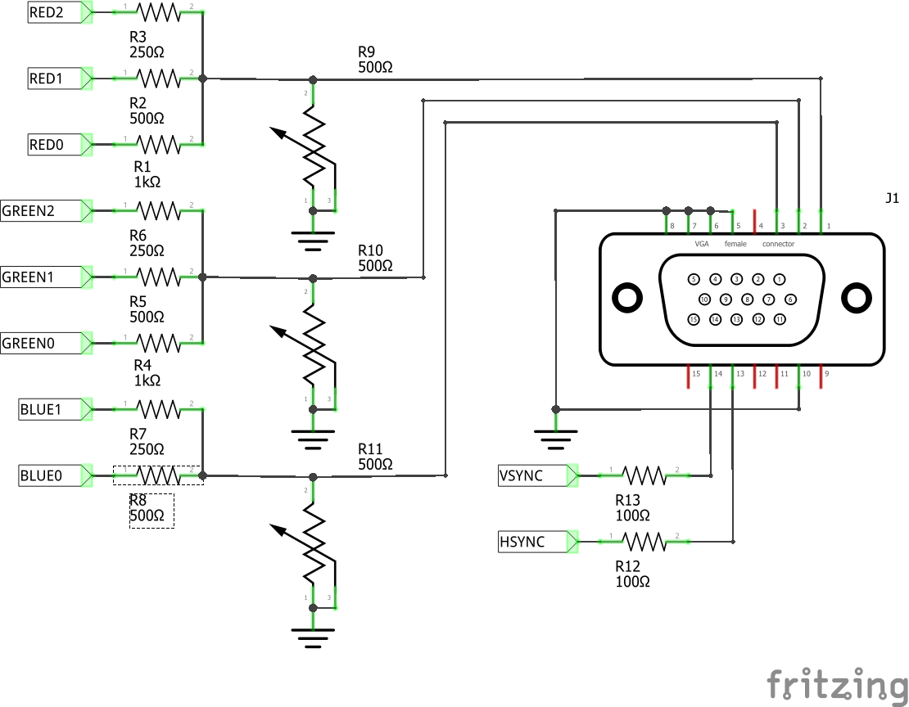

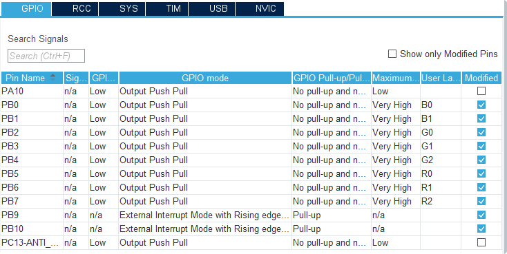
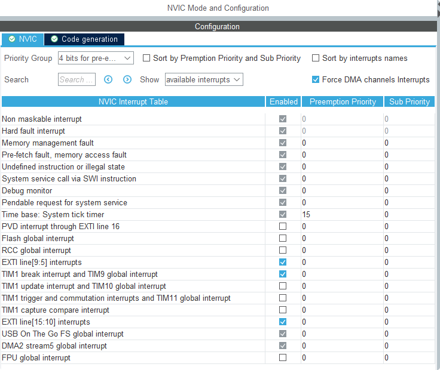

## Device Configuration Tools settings:

This project uses STM32CubeIDE and internal Device Configuration Tools (STM32CubeMX) to generate start-up code.

First, we set external clock and serial wire debug port manually, then assign HSE to PLL and set the clock at SYSCLK to 96 MHz. We set multiplier of PLL to 192 so that we can set divider to /2 for SYSCLK and /4 for USB (which requires 48MHz clock source)

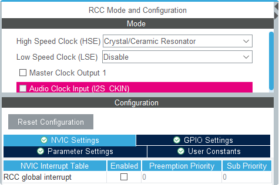
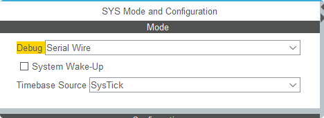
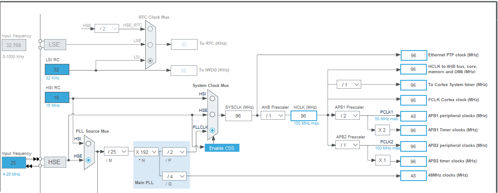

Under TIM10 settings, our custom VGA 640x480px. display mode uses 24MHz pixel clock, which is a quarter of the SYSCLK/APB2 so we set the Prescaler to 3 (4-1 = 1/4 of source frequency). One whole scan line is 800 pixel clock so Counter Period is 800-1. PWM channel 1 require the pulse to be 96-1. (using 96 is OK)

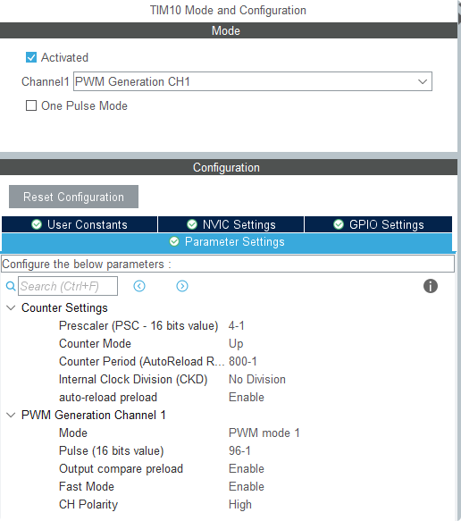

TIM9 is for V-sync signal. We need the trigger signal from TIM10, so we set TIM9 to be in slave mode using TIM10 as master with trigger source ITR2. (from TIM9 overflow)

Normally we have to set Counter Period to 525-1 (525 scan lines for the whole frame). However I found out that display output is shaking because the timing was off, so I have to reduce the number of scan line by 1. (525-2) 

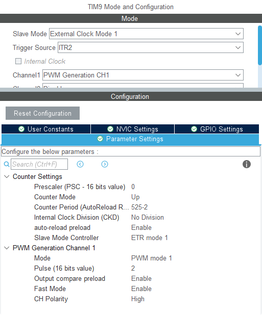

ALso, we enable TIM9 global interrupt so we can use the callback function to reset the counter that we used to tell the number of scan line we were sending to the circular buffer used by DMA.

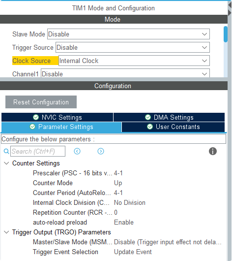
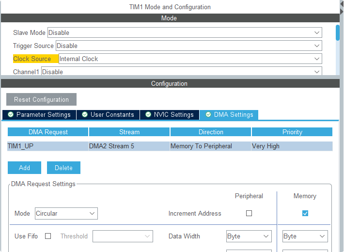

Our actual resolution is 160x120 which is 1/4th of the screen resolution at 640x480. Here, we set the Prescaler value of TIM1 at 1/4th which means the real pixel clock is 24MHz. Then we divided by 4 to achieve the actual resotion at 160 pixel by setting Counter period to 4-1. We also set the Trigger output as Update Event to be the time-base for DMA.

We enable TIM1_UP DMA channel (DMA2 stream 5) for transferring display data from memory to GPIO (peripheral). Set it as circular mode and data width is byte size. 

Then first thing in the main program, we register two callback functions using HAL_DMA_RegisterCallback() so they will be called when DMA transfers data half way, and when it completes the transfer before going back to resend from the start. (in circular fasion)  

## GPIO-host

STM32F411 supports both USB device and USB host. Here, we set the USB port to act as USB host. Since WeAct Black Pill board does not officially support USB host, there is no point enabling VBUS activation line, so we leave it unchecked.  USB speed can be either high or low speed.

We set USB device to be connected to USB bus as HID. Now a little bit of unnecessary action, STM32CubeIDE does not expect the use of USB host without enable VBUS (and disable it when unused or over-current detected). Here, I went an easy way using STM32CubeIDE instead of coding everything myself, so I just set a GPIO port (PA10, in this example) and I set the Drive_VBUS_FS to use this port so the HAL code will not throw error at me.

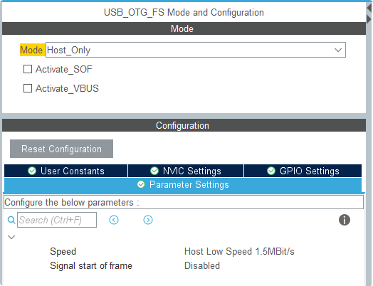

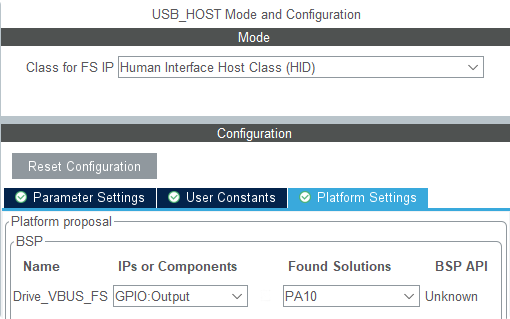

When a new data arrives, HAL will call USBH_HID_EventCallback(), which in this example we first detect if the data is from keyboard. Then read the ASCII code from it. Code below give ASCII code when a key is pressed and 0 when a key is depressed. We store the key we read in a circular buffer. Which will be accessed by our custom getch() function.

Something to note here. When the main loop takes too long and MX_USB_HOST_Process() is not call frequently enough. USB device may lost the function. So, in this case, I insert a small loop to poll the function for a few times, then read data that USBH_HID_EventCallback() prepared for us. This method may not look like much or pretty enough but it suits the example here just fine.
```
int kBin=0;
int kBout=0;
...
void USBH_HID_EventCallback(USBH_HandleTypeDef *phost){
	if(USBH_HID_GetDeviceType(phost) == HID_KEYBOARD){
		HID_KEYBD_Info_TypeDef *Keyboard_Info;
		Keyboard_Info = USBH_HID_GetKeybdInfo(phost);
		uint8_t key = USBH_HID_GetASCIICode(Keyboard_Info);
		if(key==0)return;
		if(((kBin+1)&0xf)==kBout)return;
		kBuffer[kBin]=key;
		kBin=(kBin+1)&0xf;
		HAL_GPIO_TogglePin(GPIOC,GPIO_PIN_13);
	}
}

extern uint8_t getch(char *ch){
	for(int i=0;i<10;i++){
	   MX_USB_HOST_Process();
	   HAL_Delay(2);
	}
	if(kBin==kBout) return 0;
	*ch = kBuffer[kBout];
	kBout = (kBout+1)&0xf;
	return 1;
}
```


## Bonus: A little bit of Tetris

To show an implementation of both VGA display and USB host function. I wrote a simple Tetris game that use a USB keyboard as input (using keypad 8,4,6,2,0 as input)


## Note: increasing output resolution to 320x240px.

The example here was first designed for 320x240. However, when I added USB-host function to the program it caused the display screen to shift horizontally when pressing key numerous times. This probably was the result of DMA cannot send out data to GPIO in time  because STM32 had to manage the USB at the same time. So I have to reduce the resolution by half and the problem was gone.

If you plan to use VGA display functionality with a simple program without using NIVC or other DMA, you may change do the following:

- the Counter Period of TIM1 to 2-1 (1) 
- change a number of definition in vga256.h as
```
#define VGA_WIDTH  318		
#define VGA_HEIGHT  238		

#define VGA_LBUFFER 320		
#define VGA_VBUFFER 240		

#define VGA_LBUFFERSIZE 400	
#define VGA_FULL	1600
#define VGA_HALF	800
```

VGA_WIDTH/VGA_HEIGHT is the frame size. Here it should be 320 and 240 respectively, but the values cause the frame to over-scan and might cause the frame to shake due to the actual frequency is a little bit off. So I reduced the area to this value instead. (You can try out the value though.)

- change the definition of pointers for the starting location in memory for each line. We only write each line twice, instead of four times in the example. Here, we require 4 starting location. Two for each half of DMA memory. 

```
uint16_t vga_voff[4];

.....

void VGA_update(){
	vga_voff[0] = VOFFSET;
	for(int i=1;i<4;i++)
	   vga_voff[i]=vga_voff[i-1]+VGA_LBUFFERSIZE;
}

```

- and Both callback function we use them to write each half of DMA memory will be like:

```
static void DMA_HalfCpltCallback(DMA_HandleTypeDef *hdma){
     //fill in line1
	if((line<0)||(line>=VGA_VBUFFER)){
		memset((uint8_t *)VGA_obuffer,0,VGA_FULL);
	}else{
	memcpy((uint8_t *)VGA_obuffer + vga_voff[0],VGA_buffer[line],VGA_LBUFFER);
	memcpy((uint8_t *)VGA_obuffer + vga_voff[1],VGA_buffer[line],VGA_LBUFFER);
	}
	line++;
	if(vga_stop){
		HAL_DMA_Abort_IT(&hdma_tim1_up);
		firstTrig=1;
		vga_stop=0;
		VGA_update();
	}
}

static void DMA_CpltCallback(DMA_HandleTypeDef *hdma){
    //fill in line2 (later half)
	if((line<0)||(line>=VGA_VBUFFER)){
		memset((uint8_t *)VGA_obuffer,0,VGA_FULL);
	}else{
	memcpy((uint8_t *)VGA_obuffer + vga_voff[2],VGA_buffer[line],VGA_LBUFFER);
	memcpy((uint8_t *)VGA_obuffer + vga_voff[3],VGA_buffer[line],VGA_LBUFFER);
	}
	line++;
	if(vga_stop){
		HAL_DMA_Abort_IT(&hdma_tim1_up);
		firstTrig=1;
		vga_stop=0;
		VGA_update();
	}
}
```
